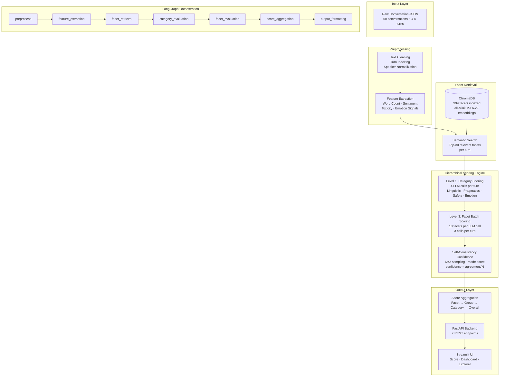

# FacetBench Architecture

## System Overview

FacetBench is a production-ready conversation scoring benchmark that evaluates
dialogue turns across 399 facets covering Linguistic Quality, Pragmatics,
Safety, and Emotion.

## Architecture Diagram



## Scoring Pipeline Detail

### Three-Level Hierarchy

```
Level 1 — Category Scoring
  Input:  conversation turn + derived features
  Model:  Qwen2.5-7B via Ollama
  Output: score (0-4) + rationale per category
  Calls:  4 per turn (fixed, regardless of facet count)

Level 2 — Facet Retrieval (ChromaDB)
  Input:  turn text
  Model:  all-MiniLM-L6-v2 embeddings
  Output: top-30 semantically relevant facets
  Calls:  1 vector search per turn

Level 3 — Facet Batch Scoring
  Input:  turn + 30 facets in batches of 10
  Model:  Qwen2.5-7B via Ollama
  Output: score + confidence per facet
  Calls:  3 per turn
```

### Call Reduction

| Approach                 | LLM Calls (50 convs × 5 turns) |
| ------------------------ | ------------------------------ |
| Naive (1 call per facet) | 399 × 250 = **99,750 calls**   |
| Hierarchical + retrieval | 7 × 250 = **1,750 calls**      |
| Reduction                | **57× fewer calls**            |

### Scoring Modes

| Mode        | Method                             | Speed              | Calls per Turn |
| ----------- | ---------------------------------- | ------------------ | -------------- |
| `full`      | LLM + facet retrieval + confidence | ~20 min/conv (CPU) | 7              |
| `fast`      | LLM category scoring only          | ~5 min/conv (CPU)  | 4              |
| `synthetic` | Heuristic rule-based               | <1 sec/conv        | 0              |

## Confidence Scoring

Self-consistency sampling:

```python
# Run same prompt N=2 times at temperature=0.7
scores = [run_1_score, run_2_score]
final_score = mode(scores)
confidence = count(mode) / N

# Examples:
# [3, 3] → score=3, confidence=1.0  (full agreement)
# [3, 2] → score=3, confidence=0.5  (disagreement)
```

Chosen over softmax logprobs because:

- Model-agnostic (works across all Ollama versions)
- Explainable to non-ML stakeholders
- No dependency on internal model probability APIs

## Scalability Analysis

| Component           | At 399 facets          | At 5000 facets         | Change   |
| ------------------- | ---------------------- | ---------------------- | -------- |
| ChromaDB retrieval  | top-30 returned        | top-30 returned        | None     |
| Category scoring    | 4 calls/turn           | 4 calls/turn           | None     |
| Facet batch scoring | 3 calls/turn           | 3 calls/turn           | None     |
| Index new facets    | python index_facets.py | python index_facets.py | None     |
| Code changes needed | —                      | —                      | **Zero** |

Adding 4,601 new facets requires only:

1. Append to `facets.json`
2. Run `python src/vectordb/chroma_client.py`

No pipeline code changes required.

## Technology Decisions

### Why Qwen2.5-7B over Llama 3 8B

Qwen2.5-7B-Instruct produces more reliable structured JSON outputs.
For a scoring pipeline where parseability = correctness, this matters
more than raw benchmark performance.

### Why ChromaDB over Pinecone/Weaviate

Zero-config embedded deployment. No external service, no API keys,
no network dependency. Persists to disk automatically.

### Why not Neo4j

Facet relationships form a fixed DAG (category → group → facet).
This is fully expressible as a JSON hierarchy with O(1) dict lookups.
Neo4j adds deployment complexity without solving a real problem at this scale.
Documented as future work for cross-facet dependency modeling.

### Why Self-Consistency over Softmax Logprobs

Logprob extraction from Ollama is version-dependent and fragile in practice.
Self-consistency is model-agnostic, requires no internal API access,
and produces naturally interpretable confidence values.

## API Endpoints

| Method | Endpoint                       | Description                            |
| ------ | ------------------------------ | -------------------------------------- |
| GET    | `/health`                      | System status + facet count            |
| GET    | `/facets`                      | List facets with category/group filter |
| GET    | `/facets/{facet_id}`           | Single facet detail + rubric           |
| GET    | `/facets/categories/summary`   | Category breakdown                     |
| POST   | `/score`                       | Score a conversation                   |
| GET    | `/benchmark/results`           | All scored conversations               |
| GET    | `/benchmark/conversation/{id}` | Single conversation result             |

## Project Structure

```
facetbench/
├── data/
│   ├── facets/facets.json          399 facet definitions
│   ├── conversations/raw/          50 generated conversations
│   └── conversations/scored/       50 scored outputs
├── src/
│   ├── pipeline/                   LangGraph orchestration
│   │   ├── state.py                ConversationState TypedDict
│   │   ├── nodes.py                8 pipeline node functions
│   │   └── graph.py                StateGraph compilation
│   ├── scoring/
│   │   ├── evaluator.py            LLM scoring engine
│   │   ├── synthetic_scorer.py     Heuristic baseline
│   │   ├── prompts.py              Prompt templates
│   │   └── confidence.py           Confidence utilities
│   └── vectordb/
│       └── chroma_client.py        ChromaDB facet retrieval
├── api/main.py                     FastAPI backend (7 endpoints)
├── ui/app.py                       Streamlit UI (3 tabs)
├── scripts/
│   ├── run_benchmark.py            Score all 50 conversations
│   ├── generate_conversations.py   Generate synthetic conversations
│   └── index_facets.py             Index facets into ChromaDB
├── Dockerfile.api
├── Dockerfile.ui
└── docker-compose.yml
```
