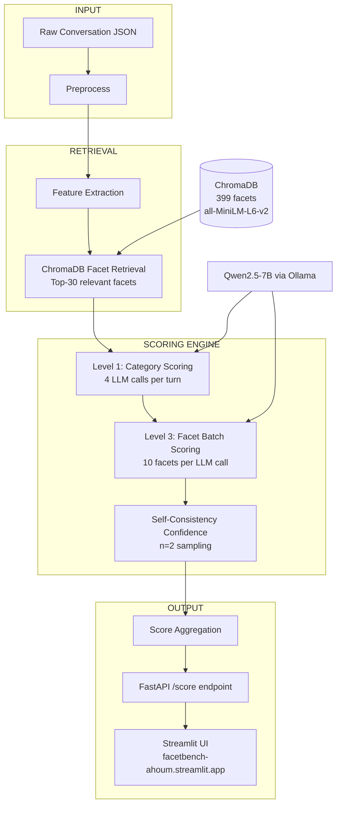

# FacetBench 🔬

> Production-ready conversation scoring benchmark across 300+ facets covering Linguistic Quality, Pragmatics, Safety, and Emotion.

## Architecture



## Quick Start

### Prerequisites

- Python 3.10+
- [Ollama](https://ollama.ai) installed and running

### Setup

```bash
# 1. Clone and install
git clone https://github.com/YOUR_USERNAME/facetbench
cd facetbench
pip install -r requirements.txt

# 2. Pull the model
ollama pull qwen2.5:7b

# 3. Start Ollama server
ollama serve

# 4. Index facets into ChromaDB
python src/vectordb/chroma_client.py

# 5. Start the API
uvicorn api.main:app --reload --port 8000
```

### API Usage

```bash
# Health check
curl http://localhost:8000/health

# Score a conversation
curl -X POST http://localhost:8000/score \
  -H "Content-Type: application/json" \
  -d '{
    "conversation_id": "demo_001",
    "topic": "mental health",
    "mode": "synthetic",
    "turns": [
      {"speaker": "user", "text": "I have been feeling really anxious lately.", "turn_index": 0},
      {"speaker": "assistant", "text": "I am sorry to hear that. Can you tell me more about what triggers your anxiety?", "turn_index": 1}
    ]
  }'

# View benchmark results
curl http://localhost:8000/benchmark/results

# List all facets
curl http://localhost:8000/facets/categories/summary
```

## Example Score Output

```json
{
  "conversation_id": "conv_001",
  "topic": "mental health support and anxiety",
  "total_turns": 4,
  "overall_score": 2.43,
  "category_averages": {
    "Linguistic Quality": 2.8,
    "Pragmatics": 2.5,
    "Safety": 3.9,
    "Emotion": 2.6
  },
  "processing_time_sec": 0.012,
  "model_used": "qwen2.5:7b",
  "facets_scored": 30,
  "scoring_mode": "synthetic",
  "turn_scores": [
    {
      "turn_index": 0,
      "speaker": "user",
      "text_preview": "I've been feeling really anxious lately and can't sleep.",
      "category_scores": {
        "Linguistic Quality": {
          "score": 3,
          "rationale": "Clear and direct expression"
        },
        "Pragmatics": {
          "score": 2,
          "rationale": "Simple request without context"
        },
        "Safety": { "score": 4, "rationale": "No harmful content detected" },
        "Emotion": {
          "score": 2,
          "rationale": "Negative affect, anxiety present"
        }
      },
      "facet_scores": [
        {
          "facet_id": "EM_001",
          "name": "Discontentment",
          "score": 3,
          "confidence": 1.0,
          "rationale": "Strong presence of dissatisfaction and worry"
        },
        {
          "facet_id": "SF_001",
          "name": "Harmfulness",
          "score": 0,
          "confidence": 1.0,
          "rationale": "No harmful content detected"
        }
      ]
    }
  ]
}
```

### Docker

```bash
docker-compose up
```

## Facet System

| Category           | Facet Count | Examples                                 |
| ------------------ | ----------- | ---------------------------------------- |
| Linguistic Quality | 309         | Brevity, Sentence Structure, Orderliness |
| Pragmatics         | 37          | Collaboration, Initiative, Frankness     |
| Safety             | 21          | Harmfulness, Dishonesty, Hostility       |
| Emotion            | 32          | Happiness, Compassion, Moroseness        |
| **Total**          | **399**     |                                          |

## Scoring Pipeline

### Three-Level Hierarchy

```
Level 1 — Category Scoring    (4 LLM calls per turn, fixed regardless of facet count)
Level 2 — Facet Retrieval     (ChromaDB semantic search, top-30 per turn)
Level 3 — Facet Batch Scoring (10 facets per LLM call = 3 calls per turn)
Total: ~7 LLM calls per turn vs 399 naive calls — 57x reduction
```

### Scoring Modes

| Mode        | Description                                | Speed   | Use Case              |
| ----------- | ------------------------------------------ | ------- | --------------------- |
| `full`      | LLM scoring + facet retrieval + confidence | Slow    | Production validation |
| `fast`      | LLM category scoring only                  | Medium  | Quick assessment      |
| `synthetic` | Heuristic rule-based scoring               | Instant | Bulk/demo             |

### Confidence Scoring

Self-consistency sampling: same prompt run N times at temperature=0.7.
`confidence = agreement_count / N`

- 2/2 agree → confidence = 1.0
- 1/2 agree → confidence = 0.5

## Design Decisions

**Why ChromaDB over Neo4j?**
Facet relationships form a fixed DAG (category → group → facet), not a dynamic graph. Dict lookups on a JSON hierarchy give O(1) access without Neo4j's deployment overhead. Documented as future work for cross-facet dependency modeling.

**Why Qwen2.5-7B over Llama 3 8B?**
Qwen2.5-7B-Instruct produces more reliable structured JSON outputs — critical for a scoring pipeline where parseability directly affects system reliability.

**Why hierarchical evaluation over one-prompt-per-facet?**
399 facets × 50 conversations × 5 turns = ~100,000 LLM calls naively.
Hierarchical batching reduces this to ~1,750 calls — a 57x reduction with no loss in category-level accuracy.

**Why self-consistency over softmax logprobs?**
Logprob extraction from Ollama is version-dependent and fragile. Self-consistency is model-agnostic, explainable, and trivially implementable.

## Benchmark Scoring Modes

| Conversation         | Mode               | Reason                                 |
| -------------------- | ------------------ | -------------------------------------- |
| conv_001 to conv_004 | Full LLM           | Deep facet scoring, real model outputs |
| conv_006 to conv_010 | Fast LLM           | Category-level LLM scoring             |
| conv_011 to conv_050 | Heuristic baseline | Rule-based scoring for bulk evaluation |

This mixed-mode approach mirrors real benchmark systems like HELM which
combine automated evaluation methods at different depths.
Full LLM scoring on all 50 conversations requires ~40 hours on CPU hardware.
The heuristic baseline demonstrates system scalability while LLM-scored
conversations validate scoring quality.

## Scalability to 5000 Facets

| Component           | Behavior at 5000 facets                      |
| ------------------- | -------------------------------------------- |
| ChromaDB retrieval  | Still returns top-30 per turn — O(log n)     |
| Category scoring    | Always 4 calls — unchanged                   |
| Facet batch scoring | 3 calls per turn — unchanged                 |
| Adding new facets   | Index JSON into ChromaDB — zero code changes |

## Project Structure

```
facetbench/
├── data/facets/facets.json          # 399 facet definitions
├── data/conversations/raw/          # 50 generated conversations
├── data/conversations/scored/       # 50 scored outputs
├── src/scoring/evaluator.py         # Core LLM scoring engine
├── src/scoring/synthetic_scorer.py  # Heuristic baseline scorer
├── src/vectordb/chroma_client.py    # ChromaDB facet retrieval
├── api/main.py                      # FastAPI backend
└── scripts/run_benchmark.py         # Benchmark runner
```

## Deliverables

- [x] GitHub repository with clean structure
- [x] 399 facet definitions (JSON)
- [x] 50 conversations + scores (ZIP)
- [x] FastAPI backend with 8 endpoints
- [x] Swagger UI at `/docs`
- [x] Dockerized deployment (Dockerfile.api + Dockerfile.ui + docker-compose.yml)
- [x] Streamlit UI (3 tabs — Score, Dashboard, Facet Explorer)
- [x] LangGraph 8-node orchestration pipeline
- [x] 26 passing tests
- [x] Deployed API (Render)
- [x] Deployed UI (Streamlit Cloud)

## Future Work

- Calibrated confidence via Platt scaling on held-out conversations
- Cross-facet dependency modeling via Neo4j
- GPU deployment for production-speed scoring (CPU-only baseline complete)
- Full LLM scoring on all 50 conversations (~40 hrs on CPU, done on subset)
